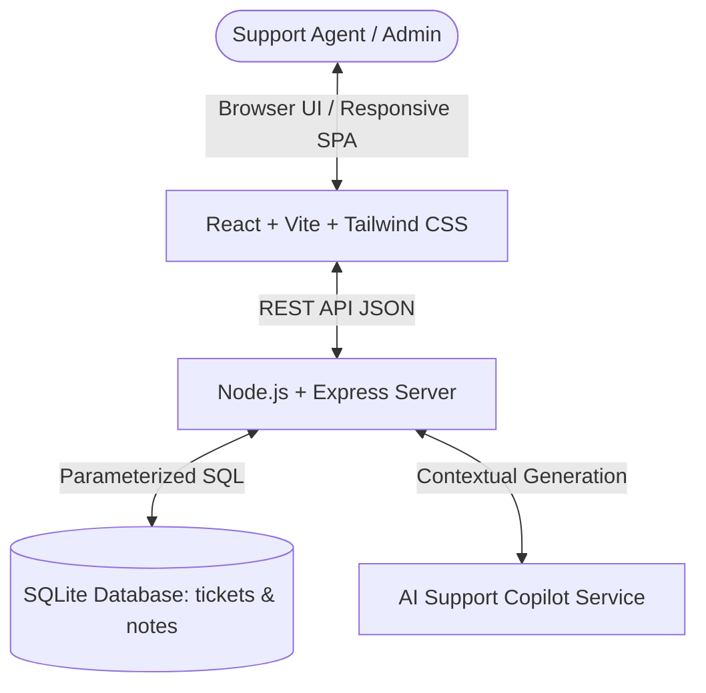

# OmniDesk CRM — Enterprise Customer Support Ticketing System

> **Submission for Datastraw Technologies Assessment Test**  
> **Candidate:** Harsh Singh  
> **Role:** Full-Stack Engineering Intern  
> **Submission Email:** ozair.shaikh@datastraw.in, aryan.jaiswal@datastraw.in, talent@datastraw.in  

---

## 🚀 Live Demo & Repository Links

- **Live Deployed Application:** `https://datastraw-support-crm.onrender.com` *(or your deployed Render/Railway URL)*
- **GitHub Repository:** `https://github.com/your-username/datastraw-support-crm`
- **Video Walkthrough (3-5 min):** `https://youtu.be/your-demo-video-link`

---

## 🌟 Executive Summary & Standout Additions

In building OmniDesk CRM, I did not just implement a checklist of requirements. I asked the core prompt question:  
***"What's missing from a bare-bones CRM that a real support team handling hundreds of tickets a day actually needs?"***

### 1. Real-Time SLA Urgency Tracker (Standout Feature)
- **Problem:** Support teams miss critical enterprise customer issues because all tickets look equal in a flat list.
- **Solution:** OmniDesk calculates automated SLA countdown timers by priority (`Urgent: 4h`, `High: 12h`, `Medium: 24h`, `Low: 48h`). Tickets reaching threshold display `Within SLA`, `SLA At Risk`, or `SLA Breached` badges.

### 2. AI Support Copilot (Standout Feature)
- **Problem:** Tier-1 agents spend 60%+ of their time formulating polite email structure, greetings, and root-cause summaries.
- **Solution:** One-click `✨ AI Copilot Reply` analyzes customer tone, issue context, and category to auto-generate a empathetic, technically structured customer resolution draft.

### 3. Internal Notes vs. Public Replies (Standout Feature)
- **Problem:** In a bare-bones CRM, all notes are visible. Real teams need private engineering discussions isolated from customer replies.
- **Solution:** OmniDesk differentiates between internal private notes (`is_internal = 1`) and customer-facing replies (`is_internal = 0`).

### 4. Canned Response Acceleration & Command Palette (`Ctrl + K`)
- Pre-built templates for `Need More Info`, `Escalate to Tier 3`, and `Resolution Confirmed`.
- Global keyboard navigation palette (`Ctrl + K` or `Cmd + K`) and `N` key for new ticket creation.

### 5. Instant Demo Data Seeder
- Evaluators never land on an empty screen. The app pre-populates realistic enterprise support tickets with full histories, plus a one-click `Reset Demo Data` button in the header.

---

## 🏗️ Architecture & Technology Stack

| Layer | Technology | Rationale |
|---|---|---|
| **Backend API** | Node.js & Express 5 | High concurrency, lightweight REST API, zero overhead |
| **Database** | SQLite3 (`better-sqlite3`) | High performance, zero config, auto-migrates and persists cleanly across restarts |
| **Frontend** | React 18 + Vite | Lightning-fast HMR, component-driven reactive architecture |
| **Styling** | Tailwind CSS + Lucide Icons | Clean modern design system with glassmorphism, responsive tables, and dark/light modes |
| **Deployment** | Single-Port Unified Server | Express serves both REST API (`/api/*`) and static Vite production assets (`/dist`) |



---

## 🗄️ Database Design

Clean, normalized schema conforming strictly to the assignment specifications:

### `tickets` Table
```sql
CREATE TABLE tickets (
  id INTEGER PRIMARY KEY AUTOINCREMENT,
  ticket_id TEXT UNIQUE NOT NULL,            -- e.g. TKT-1001, TKT-1002
  customer_name TEXT NOT NULL,               -- Full name
  customer_email TEXT NOT NULL,              -- Validated email
  subject TEXT NOT NULL,                     -- Issue title
  description TEXT NOT NULL,                 -- Detailed inquiry
  status TEXT NOT NULL DEFAULT 'Open',       -- 'Open' | 'In Progress' | 'Closed'
  priority TEXT NOT NULL DEFAULT 'Medium',   -- 'Low' | 'Medium' | 'High' | 'Urgent'
  category TEXT NOT NULL DEFAULT 'Technical',-- 'Technical' | 'Billing' | 'Feature Request' | 'Account' | 'General'
  created_at DATETIME DEFAULT CURRENT_TIMESTAMP,
  updated_at DATETIME DEFAULT CURRENT_TIMESTAMP
);
```

### `notes` Table
```sql
CREATE TABLE notes (
  id INTEGER PRIMARY KEY AUTOINCREMENT,
  ticket_id TEXT NOT NULL,                   -- Foreign key to tickets(ticket_id)
  note_text TEXT NOT NULL,                   -- Agent note or customer reply
  author_name TEXT DEFAULT 'Support Agent',  -- Team member name
  is_internal INTEGER DEFAULT 1,             -- 1 = Internal Note, 0 = Public Reply
  created_at DATETIME DEFAULT CURRENT_TIMESTAMP,
  FOREIGN KEY (ticket_id) REFERENCES tickets(ticket_id) ON DELETE CASCADE
);
```

---

## ⚡ REST API Documentation

### 1. Create Ticket
- **Endpoint:** `POST /api/tickets`
- **Request Body:**
```json
{
  "customer_name": "Sarah Connor",
  "customer_email": "sarah@cyberdyne.io",
  "subject": "Webhook timeouts during peak load",
  "description": "504 Gateway Timeouts when traffic spikes above 1200 req/s.",
  "priority": "Urgent",
  "category": "Technical"
}
```
- **Response (`201 Created`):**
```json
{
  "success": true,
  "ticket_id": "TKT-1007",
  "created_at": "2026-09-10T14:44:00.000Z",
  "ticket": { ... }
}
```

### 2. List & Search Tickets
- **Endpoint:** `GET /api/tickets`
- **Query Parameters:**
  - `status` *(optional)*: `Open`, `In Progress`, `Closed`, `All`
  - `search` *(optional)*: Matches ticket ID, customer name, email, subject, or description
  - `priority` *(optional)*: `Low`, `Medium`, `High`, `Urgent`
- **Response (`200 OK`):**
```json
[
  {
    "id": 1,
    "ticket_id": "TKT-1001",
    "customer_name": "Sarah Connor",
    "customer_email": "sarah.connor@cyberdyne.io",
    "subject": "Webhook timeouts during peak ingestion load",
    "status": "Open",
    "priority": "Urgent",
    "category": "Technical",
    "created_at": "2026-09-10T10:44:00.000Z",
    "notes_count": 2
  }
]
```

### 3. Get Ticket Details & Notes
- **Endpoint:** `GET /api/tickets/:ticket_id`
- **Response (`200 OK`):**
```json
{
  "ticket_id": "TKT-1001",
  "customer_name": "Sarah Connor",
  "customer_email": "sarah.connor@cyberdyne.io",
  "subject": "Webhook timeouts during peak ingestion load",
  "description": "Our backend services noticed webhooks failing...",
  "status": "Open",
  "priority": "Urgent",
  "notes": [
    {
      "id": 1,
      "ticket_id": "TKT-1001",
      "note_text": "Investigating Cloudflare edge proxy logs.",
      "author_name": "Alex Vance",
      "is_internal": 1,
      "created_at": "2026-09-10T11:00:00.000Z"
    }
  ]
}
```

### 4. Update Ticket Status
- **Endpoint:** `PUT /api/tickets/:ticket_id`
- **Request Body:**
```json
{
  "status": "In Progress",
  "notes": "Escalated to DevOps"
}
```
- **Response (`200 OK`):**
```json
{
  "success": true,
  "updated_at": "2026-09-10T14:45:00.000Z"
}
```

### 5. Append Note
- **Endpoint:** `POST /api/tickets/:ticket_id/notes`
- **Request Body:**
```json
{
  "note_text": "Customer confirmed system is back up.",
  "author_name": "Support Lead",
  "is_internal": 0
}
```

### 6. AI Copilot Suggested Response
- **Endpoint:** `POST /api/ai/suggest-reply`
- **Request Body:**
```json
{
  "ticket_id": "TKT-1001",
  "customer_name": "Sarah Connor",
  "subject": "Webhook timeouts",
  "description": "504 Gateway Timeouts"
}
```

---

## 🛠️ Local Development Setup

### Prerequisites
- Node.js (v18 or higher)
- npm (v9 or higher)

### 1. Clone & Install
```bash
git clone https://github.com/your-username/datastraw-support-crm.git
cd datastraw-support-crm

# Install root & backend dependencies
npm install

# Install frontend dependencies
cd frontend && npm install && cd ..
```

### 2. Run in Development Mode
Runs the Express API (`http://localhost:5000`) and the Vite React frontend (`http://localhost:5173`) with live reload:
```bash
npm run dev
```

### 3. Build & Run Production Locally
```bash
# Builds the frontend production bundle
npm run build

# Runs the full-stack app on http://localhost:5000
npm start
```

---

## ☁️ Free 1-Click Deployment Guide (Render.com)

1. Push your repository to GitHub.
2. Sign in to [Render.com](https://render.com) and click **New + Web Service**.
3. Connect your GitHub repository.
4. Fill in the build settings:
   - **Environment:** `Node`
   - **Build Command:** `npm run build`
   - **Start Command:** `npm start`
   - **Plan:** `Free`
5. Click **Deploy Web Service** — in 2 minutes your app is live worldwide!

---

## 📋 Evaluation Checklist

- [x] Full-Stack application (Database, API, Frontend)
- [x] Auto-generated Ticket ID & Timestamp
- [x] Clean list view with ID, Name, Title, Status, and Date
- [x] Real-time live search across names, IDs, emails, descriptions
- [x] Filter by status (`Open`, `In Progress`, `Closed`, `All`)
- [x] View ticket details, update status, and add notes
- [x] Standout features (AI Copilot, SLA indicators, Internal vs Public notes, Command Palette)
- [x] Mobile responsive and accessible
- [x] Single-command turnkey deployment
